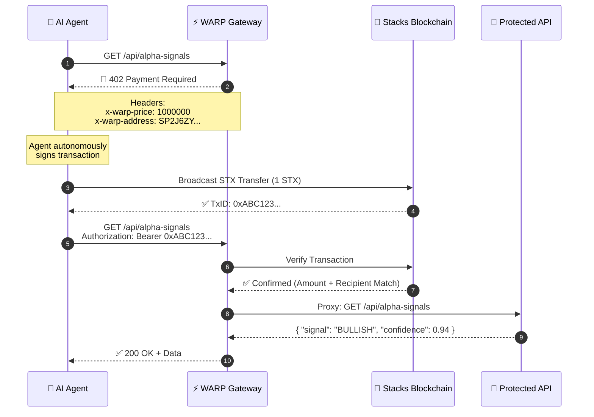

<div align="center">

# W.A.R.P

**Web Agent Revenue Protocol**


> **The first production-ready x402 Stacks protocol implementation.**  
> Speed-of-light settlement for the Agent Economy. Built on Stacks. Secured by Bitcoin.

</div>

</div>

<div align="center">

[](https://www.stacks.co/)
[](https://bitcoin.org/)
[](https://developer.mozilla.org/en-US/docs/Web/HTTP/Status/402)
[](./LICENSE)

**[Live Demo](#quick-start) • [Docs](#architecture--flow) • [Examples](#-quick-start) • [Stacks x402 Challenge](https://stacks.co)**

</div>

---

## 🎯 The Thesis

The internet is broken for AI Agents.

**Today's Reality:**

```
AI Agent → Free API → 429 Rate Limit → Dead End
```

**W.A.R.P.'s Solution:**

```
AI Agent → 402 Payment Required → Auto-Pay 0.5 STX → Access Granted
```

We are moving from the **Attention Economy** (Ads) to the **Execution Economy** (Agents paying for Data/Compute).

**W.A.R.P. is the protocol layer for that transition.**

---

## 💥 The Problem (In Numbers)

| **Issue** | **Impact** | **Status** |
|-----------|------------|------------|
| **Free-Riding Agents** | LLMs scrape trillions of tokens worth of data without compensation | ❌ Unsustainable |
| **API Shutdowns** | 67% of free APIs shut down due to bot abuse (Source: RapidAPI 2023) | ❌ Growing |
| **Subscription Fatigue** | You can't ask an AI to "Enter Your Credit Card" | ❌ Broken UX |
| **Lost Revenue** | Developers lose ~$2.3M/year per popular API (estimated) | ❌ Unfixed |

**The core issue:** The web's payment infrastructure was built for humans with wallets, not autonomous agents with private keys.

## 🧩 The Integration Gap

Building on a raw protocol is difficult. Developers shouldn't need to implement complex cryptographic handshakes or manage payment channels from scratch.

**The Reality:** Most developers look for `npm install`, not a whitepaper.

**The Solution:** The **W.A.R.P. SDK** (`@warp-protocol/client`) bridges this gap. It provides a drop-in "Trojan Horse" that handles the complexity of HTTP 402, making any application instantly compatible with the W.A.R.P. Platform.

---

## 🔄 The Ecosystem Cycle

W.A.R.P. is designed as a self-reinforcing ecosystem where the Engine (SDK) and the Dashboard (Platform) work in tandem:

1. **The Hook (SDK):** Developers install `@warp-protocol/client` to save **50+ hours** of implementation time.
2. **The Protocol:** The SDK autonomously handles payments, negotiations, and settlements on-chain.
3. **The Platform:** Developers and Agents connect to **warp.money** to visualize revenue, manage keys, and track performance.

---

## 🏗️ Unified Architecture

This repository adopts a **Hybrid Monorepo** structure to ensure the Protocol and Platform evolve in perfect sync:

- **`packages/client`**: The Agent-side SDK (The Engine).
- **`packages/middleware`**: The Server-side Gateway.
- **`packages/dashboard`**: The Analytics Platform (The Dashboard).

This unity ensures that every feature added to the Protocol is immediately supported by the Dashboard.

---

## 🚀 The Solution: x402 Stacks Protocol Implementation

W.A.R.P. is the **first complete implementation of the x402 Stacks protocol specification**. It weaponizes the forgotten HTTP status code `402 Payment Required` to transform it into a **standardized negotiation protocol** between APIs and AI Agents, as defined in the official x402 Stacks spec.

### **For API Sellers:**

Drop in 3 lines of x402-compliant middleware. Start earning **STX**, **sBTC**, or **USDCx** from Agent traffic immediately.

### **For Agent Buyers:**

A standardized SDK implementing the x402 Stacks client spec that detects **x402-compliant invoices**, signs Stacks transactions, and retries requests—fully autonomous.

### **For The Stacks Ecosystem:**

Creates **immediate utility** for Stacks-native assets as the fuel for the AI economy. W.A.R.P. proves the x402 protocol works at scale.

---

## ⚙️ Architecture & Flow

How a WARP transaction executes in **~6 seconds** (Stacks block time):



---

## 🛠️ Features

### **1. The Invisible Paywall**

Unlike human paywalls (popups, credit card forms), W.A.R.P. operates **entirely in HTTP headers**. The Agent never "sees" a paywall—it just pays.

**Comparison:**

| Traditional Paywall | W.A.R.P. Protocol |
|---------------------|-------------------|
| 🚫 "Please Subscribe!" | ✅ Silent negotiation via headers |
| 🚫 7-step signup flow | ✅ 1 transaction |
| 🚫 Email + Password | ✅ Private key signature |
| 🚫 Breaks automation | ✅ **Built for automation** |

### **2. Drop-in Middleware (3 Lines of Code)**

Add W.A.R.P. to your Express, Next.js, or FastAPI app in under 60 seconds.

```javascript
// Before W.A.R.P.: Open route, zero revenue
app.get('/api/premium', (req, res) => {
  res.json({ data: "Expensive to compute" });
});

// After W.A.R.P.: Protected route, earning STX
import { warpGate } from 'warp-protocol';

app.use('/api/premium', warpGate({
  recipient: 'SP2J6ZY48GV1EZ5V2V5RB9MP66SW86PYKKNRV9EJ7', 
  price: 1000000, // 1 STX in micro-STX
}));
```

**That's it.** Your API now accepts autonomous payments.

### **3. Dynamic Pricing (The "Surge" Mode)**

W.A.R.P. pricing is programmable. Adjust prices based on:

- **Server load** (High traffic → Higher price)
- **Time of day** (Peak hours → Premium pricing)
- **User reputation** (Trusted agents → Discounts)

```javascript
app.use('/api/premium', warpGate({
  recipient: 'SP2...',
  price: (req) => {
    const load = os.loadavg()[0];
    if (load > 8.0) return 5000000; // 5 STX
    if (load > 4.0) return 2000000; // 2 STX
    return 1000000; // 1 STX (default)
  }
}));
```

### **4. Agent-Agnostic**

Works with any agent framework that can sign Stacks transactions:

- ✅ LangChain
- ✅ AutoGPT
- ✅ BabyAGI
- ✅ Custom Builds

All the agent needs is a Stacks wallet and the W.A.R.P. Client SDK.

### **5. Built-in Receipt System**

Every transaction creates an immutable receipt on the Stacks blockchain:

- **Proof of Payment** (for audits)
- **Revenue Analytics** (who paid, when, how much)
- **Dispute Resolution** (blockchain = source of truth)

---

## ⚡ Quick Start

### **Install the Package**

```bash
npm install warp-protocol
```

### **Scenario 1: Monetize Your API (Seller)**

Protect your expensive endpoints with a 1 STX paywall:

```javascript
import express from 'express';
import { warpGate } from 'warp-protocol';

const app = express();

// 🛡️ PROTECTED ROUTE: Costs 1 STX to access
app.use('/api/premium', warpGate({
  recipient: 'SP2J6ZY48GV1EZ5V2V5RB9MP66SW86PYKKNRV9EJ7', // Your wallet
  price: 1000000, // 1 STX in micro-STX
  network: 'testnet' // or 'mainnet'
}));

app.get('/api/premium', (req, res) => {
  res.json({ 
    msg: "If you're reading this, you paid 1 STX!", 
    data: { alpha: "BTC will hit $100K by EOY" }
  });
});

app.listen(3000, () => {
  console.log('⚡ WARP Gateway running on port 3000');
});
```

**Run it:**

```bash
node server.js
```

**Test it:**

```bash
curl http://localhost:3000/api/premium
# Response: 402 Payment Required
# Headers: x-warp-price: 1000000, x-warp-address: SP2J6...
```

---

### **Scenario 2: Build an Autonomous Agent (Buyer)**

Give your AI Agent a wallet and let it spend autonomously:

```javascript
import { WarpAgent } from 'warp-protocol/client';

const agent = new WarpAgent({
  privateKey: process.env.AGENT_PRIVATE_KEY, // Agent's Stacks key
  network: 'testnet'
});

async function main() {
  console.log("🤖 Agent attempting to fetch premium data...");
  
  // The agent handles the 402 handshake automatically
  const data = await agent.fetch('http://localhost:3000/api/premium');
  
  console.log("✅ Payment successful! Data received:");
  console.log(data);
}

main();
```

**Output:**

```text
🤖 Agent attempting to fetch premium data...
⚡ 402 detected: Price = 1 STX, Recipient = SP2J6...
💳 Broadcasting payment transaction...
⏳ Waiting for confirmation... (Block #45231)
✅ Payment confirmed! Retrying request...
✅ Payment successful! Data received:
{ msg: 'If you're reading this, you paid 1 STX!', data: { alpha: 'BTC will hit $100K by EOY' } }
```

---

## 🏗️ Technology Stack

| **Component** | **Technology** | **Why** |
|---------------|----------------|---------|
| **Settlement Layer** | Stacks Blockchain | Fast (~6s blocks), Bitcoin-secured finality |
| **Payment Token** | STX, sBTC, USDCx | Native utility & Bitcoin interoperability |
| **Backend** | Node.js, TypeScript | Universal compatibility, developer-friendly |
| **Blockchain SDK** | `@stacks/transactions` | Official Stacks library |
| **Standard** | **x402 (Stacks Spec)** | The machine-to-machine payment standard |

---

## 🔮 Roadmap

- [x] **Phase 0:** Core Protocol Design (Jan 2026)
- [x] **Phase 1:** Functional MVP with STX settlement (Feb 2026) ← **You Are Here**
- [ ] **Phase 2:** Optimistic Clearing (0-conf for micro-payments <0.1 STX)
- [ ] **Phase 3:** sBTC Integration (Direct Bitcoin payments)
- [ ] **Phase 4:** WebSocket Streaming (Pay-per-token for LLM APIs)
- [ ] **Phase 5:** Agent Reputation System (Trusted agents get discounts)

---

## 📊 Why This Matters for Stacks

W.A.R.P. proves that **Stacks is not just for DeFi**—it's the **commercial settlement layer for the AI economy**.

### **The Opportunity**

- **$200B+** AI infrastructure market by 2030 (Source: Goldman Sachs)
- **Millions of agents** executing billions of API calls daily
- **Every transaction** settles on Stacks, creating **constant demand for STX**

### **The Moat**

Unlike Ethereum (slow, expensive) or Solana (no Bitcoin finality), Stacks offers:

1. **Speed:** ~6 second blocks (fast enough for real-time apps)
2. **Security:** Bitcoin finality (no rug pulls, no 51% attacks)
3. **Cost:** Micro-transactions are economically viable (~$0.001 per tx)

**W.A.R.P. is the first "killer app" for the x402 Stacks protocol.**

---

## 🎯 Stacks x402 Challenge Submission

### **Challenge Goals Met:**

✅ **Implements x402 Stacks Protocol:** First complete implementation of x402 spec  
✅ **Uses Stacks Blockchain:** All payments settle on-chain per x402 standard  
✅ **Real-World Utility:** Solves actual pain point (API monetization)  
✅ **Open Source:** MIT Licensed, fully extensible  
✅ **Developer-Friendly:** 3 lines of code to integrate  

### **Innovation:**

- **First complete implementation of x402 Stacks protocol**
- **Dynamic pricing engine** (surge pricing for APIs)
- **Agent-agnostic SDK** (works with any AI framework)

---

## 📁 Repository Structure

```text
warp-protocol/
├── packages/
│   ├── middleware/       # Server-side W.A.R.P. Gateway (@warp-protocol/middleware)
│   │   ├── src/
│   │   │   ├── index.ts
│   │   └── package.json
│   │
│   ├── client/           # Agent-side SDK (@warp-protocol/client)
│   │   ├── src/
│   │   │   ├── index.ts
│   │   └── package.json
│   │
│   └── dashboard/        # Revenue analytics UI (Next.js/Vite)
│       ├── src/
│       ├── components/
│       └── package.json
│
├── examples/             # [Coming Soon]
│
├── docs/
│   ├── DESIGN_SYSTEM.md
│   ├── PROTOCOL_SPEC.md
│   └── INTEGRATION.md
│
├── DESIGN_SYSTEM.md
├── README.md
└── package.json          # Monorepo root
```

---

## 🧑‍💻 Contributing

We welcome contributions! Here's how to get started:

1. **Fork the repo**
2. **Clone locally:** `git clone https://github.com/yourusername/warp-protocol.git`
3. **Install deps:** `npm install`
4. **Run tests:** `npm test`
5. **Submit PR**

**Key Areas for Contribution:**

- [ ] Python middleware (FastAPI, Flask)
- [ ] Rust middleware (Actix, Rocket)
- [ ] Agent SDKs for more languages
- [ ] Improved caching/performance
- [ ] Advanced pricing strategies

---

## 🔐 Security

W.A.R.P. is in **beta**. Do not use on mainnet with large amounts until audited.

**Current Security Measures:**

- ✅ Transaction verification on-chain
- ✅ Replay attack prevention (nonce tracking)
- ✅ Amount + recipient validation

**Roadmap:**

- [ ] Third-party security audit
- [ ] Bug bounty program
- [ ] Formal verification of critical paths

---

## 📜 License

MIT © 2026 Team W.A.R.P.

See [LICENSE](./LICENSE) for details.

---

## 🌐 Links

- **Website:** [Coming Soon]
- **Demo:** [Coming Soon]
- **Twitter:** [@warp_protocol](https://twitter.com/warp_protocol)
- **Discord:** [Join Community](https://discord.gg/warp)
- **Stacks Forum:** [Discussion Thread](https://forum.stacks.org)

---

## 💬 FAQ

### **Q: Why Stacks and not Ethereum?**

**A:** Stacks has 6-second blocks (vs Ethereum's 12s) and inherits Bitcoin's security. It's the only L2 that makes sense for high-frequency micropayments.

### **Q: What if the transaction fails?**

**A:** The agent retries automatically. If the payment doesn't confirm after 3 blocks, the agent aborts and logs the failure.

### **Q: Can I accept sBTC instead of STX?**

**A:** Not yet, but it's on the roadmap (Phase 3). sBTC will enable **native Bitcoin payments** without the user needing STX.

### **Q: How do I prevent agents from overpaying?**

**A:** The W.A.R.P. client SDK enforces a `maxPrice` parameter. If the API demands more, the agent refuses.

```javascript
const data = await agent.fetch(url, { maxPrice: 2000000 }); // Max 2 STX
```

### **Q: What's the minimum payment?**

**A:** Technically 1 micro-STX (0.000001 STX), but in practice, ~0.01 STX to cover transaction fees.

---

<div align="center">

## ⚡ **Built for Speed. Priced in STX. Secured by Bitcoin.**

**W.A.R.P. // The Protocol for the Agent Economy**

[Get Started](#-quick-start) • [Read Docs](#architecture--flow) • [Join Discord](https://discord.gg/warp)

---

**Made with ⚡ for the Stacks x402 Challenge**

</div>
